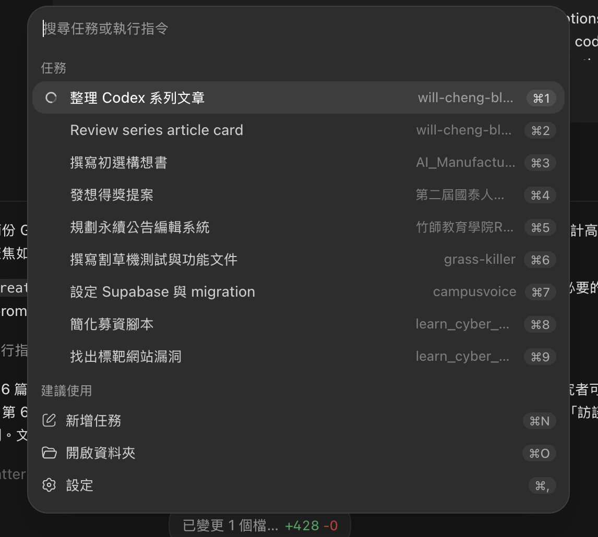
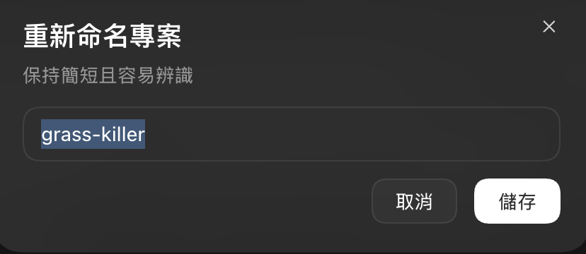
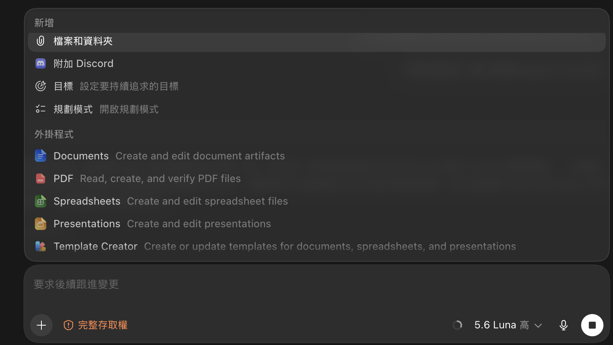
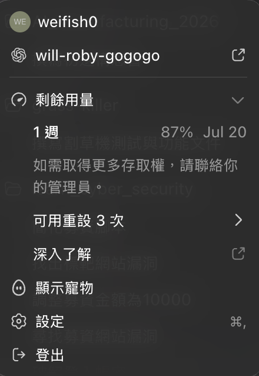

前幾篇文章已經介紹 Codex 是什麼、如何安裝桌面 App，以及如何建立第一個專案。接下來可以把注意力放回每天都會使用的地方：Codex 的介面與工作控制。

Codex 不只是下方有一個輸入框的聊天工具。它同時管理了幾種重要的工作狀態：目前在哪個專案、這段對話的任務是什麼、Codex 可以碰哪些檔案、使用哪個模型、還剩多少額度，以及目前對話已經佔用了多少上下文。

如果能先理解這些功能模塊，日後遇到「找不到上一段工作」、「Codex 改了不該改的檔案」、「回答開始偏離任務」或「突然不能繼續使用」時，就比較知道應該從哪裡檢查。

> 本文以 Codex 桌面 App 的目前介面為例。功能名稱、快捷鍵與模型選項可能會隨版本、作業系統、帳號方案或工作區設定調整；如果畫面上的文字與本文不同，請以你的 App 顯示為準。

## 一、先認識 Codex 的工作層級

使用 Codex 時，可以先用下面這個簡單的層級來理解畫面：

| 層級 | 它管理的內容 | 你可以問自己的問題 |
| --- | --- | --- |
| 專案 | 工作資料夾與相關對話 | 這些檔案屬於哪一個工作？ |
| 對話 | 一次任務的上下文與歷史紀錄 | 這段對話要完成什麼？ |
| 模型與推理 | Codex 如何思考與回應 | 這個任務需要多少推理？ |
| 額度與上下文 | 可使用量與目前對話容量 | 還能工作多久？目前對話是否太長？ |

這個分層很重要。例如，封存對話只是在整理歷史紀錄，不會自動刪除專案資料夾；調高推理強度也不會替你解除檔案權限；上下文快滿了，也不代表五小時額度已經用完。

## 二、搜尋與整理對話

### 使用搜尋快速找回工作紀錄

當對話數量增加後，不需要逐一翻看左側欄位。你可以使用以下任一方式搜尋對話紀錄：

- 按下 `Control + G` 開啟搜尋。
- 在左側欄位按下搜尋按鈕，再輸入關鍵字。

搜尋時可以使用專案名稱、任務名稱、檔案名稱或曾經在對話中提過的關鍵字。



建議在每段對話開頭就說明任務範圍，並在最後要求 Codex 摘要完成內容與待辦事項。這樣未來搜尋時，比較容易透過「任務目的」找到對話，而不是只能記得某一句零散的提問。

### 重新命名專案

專案建立後，可以點擊專案旁邊的三個點，在選單中找到重新命名專案的功能。
好的專案名稱能幫助你在左側欄位快速辨認目前工作的資料夾。



### 重新命名對話

如果一個專案裡有很多對話，也可以直接對著某段對話按右鍵，選擇重新命名任務。


## 三、封存不再需要放在側欄的對話

對話太多時，可以在對話右側找到封存按鈕，將暫時不需要放在主列表中的對話封存起來。封存適合用來整理介面，例如：

- 已經完成的練習任務
- 暫時擱置的研究想法
- 不需要每天查看、但未來可能參考的對話

封存和刪除是兩件不同的事。封存會將對話從主要列表隱藏，但不等於把對話內容刪除

要查看封存的內容，可以依序進入：

```text
左下角設定 → 已封存的任務（或 Archived chats）
```

在已封存的任務中，你可以找到原本的對話，也可以取消封存，讓它重新出現在主要列表。

## 四、增加圖片與檔案作為參考資料

如果 Codex 需要理解一張畫面、一份文件或某個資料檔，可以點擊權限管理左側的加號 `+`，加入圖片和檔案作為參考資料。

常見的使用情境包括：

- 附上錯誤畫面，請 Codex 判斷問題可能出在哪裡。
- 附上介面截圖，請 Codex 依照畫面調整網頁。
- 附上研究規範、codebook 或格式範例，讓 Codex 依照規則工作。
- 附上 CSV、Excel、PDF 或 Markdown，請 Codex 先閱讀再分析。

加入檔案後，最好在提示中明確說明它的角色：

```text
請把 codebook.md 當作編碼規則，把 transcripts/ 裡的檔案當作原始資料。
不要修改原始資料，分析結果請輸出到 outputs/。
```



## 五、權限管理：先決定 Codex 可以做什麼

在對話框下方，可以看到權限管理的下拉選單。Codex 的權限控制通常以沙箱為核心，將目前工作空間，也就是專案資料夾，視為一個受限制的工作範圍。

你會看到的選項可能包含：

- 要求核准
- 待我核准
- 完整存儲權

不同版本的中文翻譯可能略有差異，但理解它們背後的權限邏輯，比背下選項名稱更重要。

### 要求核准

在要求核准模式下，Codex 通常可以在目前沙箱，也就是專案資料夾中讀取與寫入檔案。

沙箱限制不是模型「自我約束」而已，而是 Codex 透過底層作業系統功能實現的工作邊界。一般來說，它不能直接：

- 修改沙箱外的檔案
- 讀取不在工作範圍內的資料
- 任意連接外部網路

如果任務需要存取沙箱外的檔案，或需要網路連線，Codex 可能提出提權操作，也就是 escalation。這時會需要人工審核，讓你決定是否允許這一次操作。

### 待我核准

在待我核准模式下，Codex 會對需要提權的操作先在自己內部的一個小的ai模型進行安全判斷，再決定是否可以直接放行或交給人員審核。

可以用以下方式理解：

| 判斷結果 | 處理方式 |
| --- | --- |
| 低風險 | 可能直接放行，減少不必要的中斷 |
| 高風險或不明確 | 要求人工核准 |

這是比較通用普遍的權限設定

### 完整存儲權

完整存儲權會大幅放寬沙箱限制，讓 Codex 可以在電腦上進行更廣泛的檔案與指令操作。這是高風險設定，因為一旦任務描述不清楚、指令有副作用，或專案中存在不可信任的腳本，影響範圍都可能超出目前資料夾。

使用前至少要確認：

1. 你知道 Codex 為什麼需要完整權限。
2. 目前對話中的任務範圍清楚且有限。
3. 重要資料已有備份或版本控制。
4. 不會把密碼、API key 或私人資料放進不必要的工作範圍。

一般情況下，先使用限制較小的模式即可。權限越大，不代表 Codex 就越聰明，只代表它能做的事情更多；真正重要的是讓權限和任務需求相符。

## 六、上下文使用量：知道 Codex 還記得多少

上下文使用量資訊主要顯示歷史對話內容佔用了多少模型上下文空間。上下文可以想成 Codex 在這段對話中能同時放在工作記憶裡的內容，包括：

- 你之前提出的要求
- Codex 已經做過的判斷
- 工具輸出與錯誤訊息
- 檔案修改摘要
- 對話中附上的參考資料

當上下文接近上限時，Codex 可能會自動壓縮對話歷史，釋放出更多空間。你也可以輸入 `/精簡` 手動觸發上下文壓縮；實際命令名稱可能會依介面語言或版本不同。

### 清空通常優於精簡

精簡的目的，是保留目前任務仍然需要的重點，捨棄較早、較細的對話內容。但對 AI Agent 來說，歷史越多不一定越好。過多的上下文可能讓 Codex：

- 把已經取消的舊要求當成目前要求
- 混淆不同階段的檔案狀態
- 反覆回到早期的錯誤方向
- 花更多時間處理與當前任務無關的內容

因此，當一個任務已經完成，或你準備開始完全不同的工作時，通常「開一段新的對話」比不斷壓縮舊對話更適合。

可以把兩者分成這樣：

| 做法 | 適合情境 |
| --- | --- |
| 精簡 | 同一個任務還沒完成，只需要保留關鍵脈絡 |
| 開新對話 | 任務已完成、方向改變，或舊歷史開始干擾判斷 |

開新對話時，不要只寫「接續上一個任務」。更穩定的做法是重新提供目前狀態、目標、相關檔案與驗收條件。

## 七、模型選擇與推理強度

模型設定通常包含三個部分：推理強度、模型切換，以及速度。

### 推理強度

推理強度可以依任務複雜度調整：

- 簡單任務：重新命名檔案、修改文字、調整小段樣式。
- 中等任務：整理資料、修改多個檔案、除錯一般錯誤。
- 困難任務：設計系統架構、分析複雜資料、處理跨檔案依賴或定位難以重現的錯誤。

推理強度越高，通常越願意花時間拆解問題、檢查假設與驗證結果，但回應時間與額度消耗也可能增加。不是所有任務都需要最高強度；如果只是要求 Codex 將段落改成繁體中文，使用最高設定通常沒有必要。

### 模型切換

依目前介面，你可能會看到不同的模型選項，例如：

- GPT-5.6 sol
- GPT-5.6 terra
- GPT-5.6 luna

模型名稱與可用選項會受到產品版本與帳號方案影響，因此應以你的下拉選單為準。選模型時，不必只追求名稱看起來最強的那一個，而是要看任務是否需要更深的推理、較快的回覆，或更穩定的長流程執行。

### 速度

速度通常會分成標準與快速。快速模式可以縮短等待時間，但可能會增加 Token 消耗；目前介面提示的快速模式約為標準模式的 1.5 倍消耗，仍應以當下畫面顯示為準。

一個簡單的選擇方式是：

| 任務類型 | 建議起點 |
| --- | --- |
| 困難、需要拆解與驗證的任務 | `sol high` |
| 簡單、希望快速完成的任務 | `luna high` |

這不是固定規則。若 `luna high` 已經能穩定完成簡單任務，就不需要為了所有工作都切換到更高成本的設定；如果 Codex 在複雜任務中反覆犯錯，再提高推理強度通常更合理。

## 八、剩餘額度：同時看五小時與週額度

在左下角設定頁面，可以查看目前的剩餘額度。這裡通常要同時注意兩個不同的限額：

- 五小時限額
- 週限額

兩個限額是分開計算的。只要其中任意一個到達上限，就可能暫時無法繼續使用；不過兩個限額都有各自的重置時間，可以在設定頁面查看何時恢復。



## 九、一套適合日常使用的檢查順序

當你準備在 Codex 開始一個新任務時，可以依照下面的順序快速確認：

1. **專案對嗎？** 確認目前工作空間是正確的資料夾。
2. **對話名稱清楚嗎？** 先用一句話說明這次要完成的任務。
3. **參考資料足夠嗎？** 加入規範、範例、圖片或資料檔，並說明每份檔案的用途。
4. **權限足夠但不過大嗎？** 先使用沙箱範圍內的權限，只有必要時才核准提權。
5. **模型適合嗎？** 簡單工作不必使用最高成本，困難工作則保留足夠推理強度。
6. **上下文乾淨嗎？** 如果舊任務已結束，開新對話通常比繼續堆疊歷史更穩定。
7. **額度夠嗎？** 查看五小時與週限額，避免在長任務中途才發現受到限制。

任務完成後，再把對話重新命名。未來可能會用到但不需要放在側欄的內容，就封存起來；重要成果則應該保存到專案檔案或版本控制中，不要只留在聊天紀錄裡。

## 最後的想法

熟悉 Codex 的功能模塊，真正的目的不是記住每一個按鈕，而是建立一種可控的工作節奏：用專案整理範圍，用對話管理任務，用參考資料提供脈絡，用權限限制風險，用模型與推理強度分配成本，再用上下文與額度資訊決定何時繼續、精簡或重新開始。

當這些設定都能配合起來，Codex 就不只是「幫我寫一段程式」的工具，而會變成一個能在清楚邊界內持續工作的協作環境。下一篇開始，我們就可以把這套工作方式帶進實際的研究資料整理與分析流程。
