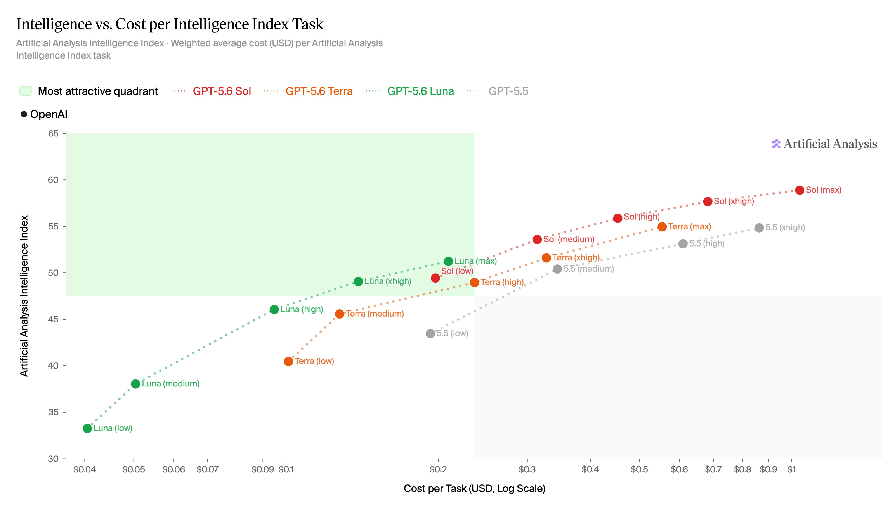

# GPT-5.6 模型與 effort：在 Codex 裡怎麼選？

在 Codex 裡選模型時，通常會看到兩個概念：模型系列，以及 `effort`。可以先把它們想成：

- 模型系列：決定模型的整體能力、速度與價格區間。
- `effort`：決定模型願意花多少推理資源處理這一次任務。

`effort` 不是另一個完全不同的模型，而是能力與等待時間之間的調整旋鈕。任務越複雜，通常越值得提高 effort；簡單工作則不需要每次都使用最高設定。

## GPT-5.6 的三個模型系列

Artificial Analysis 目前將 GPT-5.6 分成三個系列，每個系列都有 `low`、`medium`、`high`、`xhigh`、`max` 五種 effort：

| 模型系列 | 大致定位 | 適合情境 |
| --- | --- | --- |
| **Luna** | 速度快、成本低 | 摘要、格式整理、簡單修改、日常問答 |
| **Terra** | 能力與成本較平衡 | 一般程式開發、研究整理、除錯與分析 |
| **Sol** | 推理能力較強、成本較高 | 複雜重構、長流程規劃、重要研究與疑難問題 |

這張圖的縱軸是 Artificial Analysis Intelligence Index，越高代表測試中的整體能力越強；橫軸是完成一個 benchmark task 的加權平均成本，使用對數刻度，越左代表成本越低。左上角的綠色區域，代表「能力較高、成本較低」的理想區域。

要注意，圖中的 cost per task 是 Artificial Analysis 依照多項測試計算的任務成本，不是單純的 API 輸入或輸出 token 單價。它比較適合用來看相對趨勢，而不是直接當作帳單金額。

## 五種 effort 有什麼差別？

| effort | 特點 | 建議使用時機 |
| --- | --- | --- |
| `low` | 最快、消耗較少 | 簡單查詢、文字整理、小幅修改 |
| `medium` | 速度與品質平衡 | 大多數日常 Codex 任務，可作為預設值 |
| `high` | 願意進行更多分析 | 複雜除錯、資料分析、跨檔案修改 |
| `xhigh` | 更重視推理品質 | 長流程規劃、架構設計、難解問題 |
| `max` | 將能力優先於速度與成本 | 最重要或最困難的任務，且可以等待較久 |

effort 越高，不代表每個答案都一定更好；它通常代表模型會花更多時間思考，也可能產生較高成本。對一個只需要重新命名檔案的任務使用 `max`，通常沒有必要。

## 實際選擇建議

可以先用這個簡單規則：

1. **不確定時：** 使用 Terra `medium` 或 Luna `high`。
2. **只是整理與改寫：** 使用 Luna `low` 或 `medium`。
3. **要修改程式、分析資料：** 使用 Terra `high`。
4. **遇到複雜架構、長流程或多次失敗：** 改用 Sol `high`、`xhigh` 或 `max`。
5. **任務已經很簡單：** 不要因為模型名稱較高階，就固定使用最高 effort。

最實用的方式不是永遠選最強模型，而是先用合理的設定開始；如果 Codex 在規劃、除錯或驗證上遇到困難，再提高模型系列或 effort。這樣通常能在品質、速度與使用量之間取得比較好的平衡。
